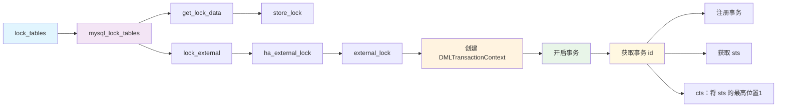

--- 
layout: ../../layouts/BlogPost.astro
title: "KMemStoreDB undo 日志与事务可见性"
description: "介绍 KMemStoreDB 内存引擎 undo 日志实现与事务可见性判断"
publishDate: "2025-07-12"
tags: ["数据库内核原理", "事务", "undo"]
---

本文介绍我们在 KMemStoreDB 内存引擎中实现的 undo 日志以及基于 undo 日志的事务可见性判断。

## 事务可见性判断

事务开始时获取开始时间戳 sts，提交时获取提交时间戳 cts。sts 和 cts 并非真正的时间戳，而是标识先后顺序的 uint64 类型整数，并且只有低 63 位有效，最高位始终为 0。对于活跃事务，还未提交，所以没有 cts，但其 cts 被我们用来表示事务 id，事务 id 最高位为 1。也就是说，一个 uint64 类型的整数被分为了两个部分，最高位为状态标志，低63位才是时间戳或事务id，如下所示：
```
uint64 值 = [1位状态标志][63位时间戳或事务ID]
```

这样设计能够保证事务 id（最高位为1）永远大于 sts 和 cts，可以更方便地判断事务的可见性：如果一个事务 a 的 sts 大于另外一个事务 b 的 cts，即事务 a 在事务b 后发生，那么 a 能够看到 b 的修改，
判断的逻辑就是：`a.sts > b.cts`，如果 b 尚未提交，那么 a.sts 必然小于 b.cts，所以 a 也就无法看到 b 的修改。


事务可见性核心逻辑如下所示：

```c++
auto canSee = [ & ](uint64 next_undo_ts) -> bool {
    return (next_undo_ts == txn_cts) || (next_undo_ts < txn_sts);
};
```

这段代码用于遍历 undo 列表，找到第一个本事务可见的版本，是 KMemStoreDB MVCC 核心，含义如下：
1. 本事务的修改对本事务可见
2. 其他事务修改的版本，如果其提交时间戳（cts）小于当前事务的开始时间戳（sts），即发生在当前事务之前则可见，否则不可见


## undo 版本链

KMemStoreDB 内部维护数据的历史版本，具体而言是 undo 链，下面我们从事务流程角度，一起看看 undo 的设计与实现。

### 事务流程

#### 开启事务




