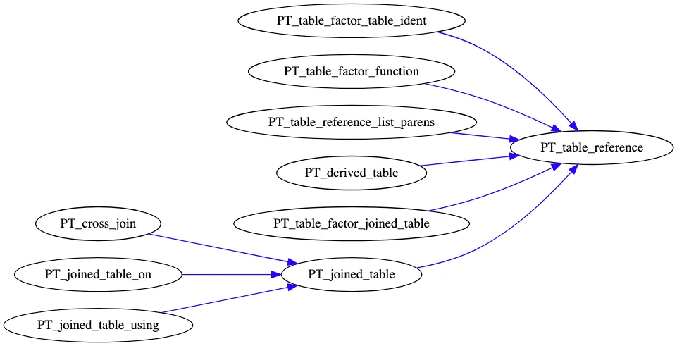

本文主要介绍 MySQL 中自然连接（natural join）和 join using 语句实现的原理，源码分析基于 mysql8.0.30 版本。

## natural/using 介绍

natural join 和 join using 都可以看作等值连接的特殊情况，都能改写为等价的 join on 语句。

natural join 将两张表按照其共同列（名称相同）做等值 join， using 可以额外指定需要做等值 join 的列，但 using 的列必须在每张表中都存在。natural [left] join 与 using 语句在语义上是等价的。

natural/using 在 select * 时，输出的列信息与 join on 有一点小小的区别， natural/using 都是按照 sql2003 标准进行 select * 补全的，具体如下：

1. 重复的列只会输出一次，而非两次
2. 列的去重和顺序按照以下规则来：

    a. 首先输出共同列（名称相同），按照其在第一张表的顺序，输出其 `coalesce` 的结果

    b. 接着输出第一张表中剩下的列

    c. 最后输出第二张表中剩下的列


注：coalesce 是一个函数，其定义为：`COALESCE(x, y) = (CASE WHEN x IS NOT NULL THEN x ELSE y END)`

REF：

> A consequence of the definition of coalesced columns is that, for outer joins, the coalesced column contains the value of the non-`NULL` column if one of the two columns is always . If neither or both columns are , both common columns have the same value, so it doesn't matter which one is chosen as the value of the coalesced column. **A simple way** to interpret this is to consider that a coalesced column of an outer join is represented by the common column of the inner table of a `JOIN`. Suppose that the tables `t1(a, b)` and `t2(a, c)` have the following contents
>

## 深入解析

### 词法分析



table_reference

上图是 mysql 中表的数据结构的设计，`PT_table_reference` 是表的基类，派生类有：

1. PT_derived_table：派生表，也就是from子查询
2. PT_joined_table: 代表join语句，又可以细分为 cross join（没有任何 join 条件）、join on 和 join using（natural归为此类）
3. PT_table_factor_joined_table: 表示带有括号的join，如：( a join b)
4. PT_table_factor_table_ident: 普通的表
5. PT_table_reference_list_parens: 括号括起来的 table reference，如：(a, b, c)

join操作通过是左关联的，如：

```
t1 JOIN t2 ON t1.a = t2.a JOIN t3 ON t3.a = t2.a
 <==> (t1 JOIN t2 ON t1.a = t2.a) JOIN t3 ON t3.a = t2.a

t1 JOIN t2 JOIN t3 ON t2.a = t3.a
 <==> (t1 JOIN t2) JOIN t3 ON t2.a = t3.a

```

在某些情况下，即使没有括号，join也有可能是右关联的，如：

```
t1 JOIN t2 JOIN t3 ON t2.a = t3.a ON t1.a = t2.a
 <==>  t1 JOIN (t2 JOIN t3 ON t2.a = t3.a) ON t1.a = t2.a

```

mysql 为了处理上述这条 sql，引入了一个 fake token：`CONDITIONLESS_JOIN`，它的优先级比join 所涉及到的其他的 token 的优先级要低。以这样一种方式，mysql 保证最后在将语句规约成 cross join。

按照这样的规则，mysql 处理`t1 JOIN t2 JOIN t3 ON t2.a = t3.a`，应当生成如下的join树：

```
                    JOIN
                   /    \
                 t1    JOIN ON t2.a = t3.a
                      /    \
                     t2    t3

```

这是不符合此 sql 的语义的。

mysql 采用了一种听起来很奇怪（outlandish）的方式来解决此问题，那就是：

> 如果 cross join 的右孩子是一个 join tree，那么就将该 join tree 的最左边的叶子节点替换成 cross join，cross join 的左孩子是原 cross join 的左孩子，右孩子是被替换掉的节点。
>

整个过程如下所示，将原 t2 的位置换成了 x，再将 x 替换成 t1 和 t2 组成的cross join。

```
                       JOIN ON t2.a = t3.a
                      /    \
                     x    t3

                       JOIN ON t2.a = t3.a
                      /    \
                    JOIN    t3
                   /    \
                  t1    t2

```

### contextualize

**数据结构：**

1. TABLE_LIST

    语境化过程中，将 ast tree 转化为 TABLE_LIST 表示的 join tree。

    TABLE_LIST 中跟 join 处理相关的成员变量：

    - embedding 表示该表所属的 nested join
    - join_list 表示该表所属的 join_list
    - query_block 表示该表所属的 query block
    - nested_join 用以表明该 TABLE_LIST 代表 join
    - alias 表名
    - natural_join 该变量指向 natural join 的左表，而`this`代表的就是 natural join 的右表。
    - is_natural_join 表示该 TABLE_LIST 是否代表的是 natural join
    - join_using_fields 存储 using 的列
    - join_columns 表示参与 natural/using 的列
    - is_join_columns_complete 表示 join_columns 是否包含 table 所有的列

    一般而言，TABLE_LIST 代表的是数据库中的一张表。但在处理join的时候，mysql会创建两张特殊的 TABLE_LIST 来表示 JOIN，它们的 alias 分别为 "(nest_last_join)" 和 "(nested_join)"，且其 nested_join 域不为空。

    mysql 会利用这两张特殊的表将参与 join 的表组织成 join tree（下文中详细描述）。

2. Query_Block
    - join_list 存储该 query block 的 join tree
    - embedding 指的是上述 join tree 所属的 "(nested_join)"
3. NESTED_JOIN
    - join_list 存储的是参与join的各个表，也可以理解为 join tree 的孩子节点
    - natural_join_processed 表明该 join tree 是否已经处理过了，避免处理多次

**处理过程：**

1. mysql 在处理每张表时，会调用 `add_joined_table` 将一个 TABLE_LIST 对象加入到当前 query block 的 `join_list` 的头部。
2. 在处理 join 时，mysql 还会调用 `nest_last_join` 将 join_list 头部的两个 TABLE_LIST 替换成一个特殊的 TABLE_LIST，具体如下：
    1. 创建一个名为 "(nest_last_join)" 的特殊的 TABLE_LIST，这个 TABLE_LIST 的 `nested_join` 不为空
    2. 从 query block 的 join_list 头部取出 2 张表，将其存入到 "(nest_last_join)" 的 nested_join 的 `join_list` 中
    3. 将 "(nest_last_join)" 放回到 query block 的 join_list 头部

    可以理解为：将弹出的 2 张表作为弹进去 "(nest_last_join)" 的孩子，这样就构造出了一颗 join tree。


带有括号的join，对应的数据结构是 `PT_table_factor_joined_table` ，在其 contextualize 之前调用 `init_nested_join`，之后调用 `end_nested_join`。

- init_nested_join 的主要作用是使得当前对于 join tree 的生成工作进入到括号当中，具体内容如下：
    1. 创建一个名为 "(nested_join)" 的特殊的 TABLE_LIST
    2. 将 "(nested_join)" 放入 join_list 的头部
    3. 将 embedding 设置为 "(nested_join)"
    4. 将 join_list 改为 "(nested_join)" 的 nested_join 的 join_list
- end_nested_join 的主要作用是还原到上一个level，即退出处理括号内的内容，具体内容如下：
    1. 还原 join_list 和 embedding (原来的值保存在 embedding 中)
    2. 如果括号中只有一张表，那么会将该表提升到当前level（可以简单理解为去掉了括号）
    3. 如果没有表的话，直接从 join_list 中去掉 "nested_join"

例子： `t1 join (t2 join (t3 join ( t4 join (t5))))`

### prepare

入口：

```
  if (leaf_table_count >= 2 &&
      setup_natural_join_row_types(thd, join_list, &context))
    return true;

```

该入口处于 Query_Block 的 `preprae` 函数当中，主要是用来处理 natural/using ，可以看到该只有 `lefa_table_count >= 2` 时，才能进入到 `setup_natural_join_row_types` 当中。

那么，很自然的，我们会问 "leaf_table_count" 什么时候会大于等于 2 ？ leaf table 是什么？

Answer：leaf table 是 join树的叶节点，即参与join的那些表，如果是view，则是view中join树的叶节点。 leaf table 的数目 >= 2 说明 from clause 是一个 join。

通过源代码可以看到，`setup_natural_join_row_types` 调用了一个 dfs 函数：`store_top_level_join_columns`。

store_top_level_join_columns 会递归处理所有的 natural/using 节点：

1. 调用 `mark_common_columns` 找出 join 的左右表之间的共同列，并将其转化为 join on
2. 调用 `store_natural_using_join_columns` 按照 sql2003 标准构造 select * 的输出列，并储存到表示 JOIN 的 TABLE_LIST 的 `join_columns` 域中。

**mark_common_columns**

`mark_common_columns` 的核心代码如下所示：

```
for (it_1.set(table_ref_1); !it_1.end_of_fields(); it_1.next()) { //  遍历 table_ref_1 的 field
    for (it_2.set(table_ref_2); !it_2.end_of_fields(); it_2.next()) { // 遍历 table_ref_2 的 field
       if (!my_strcasecmp(system_charset_info, field_name_1, cur_field_name_2)) { // 比较名称是否相同（忽略大小写）
         if (cur_nj_col_2->is_common ||
             (found && (!using_fields || is_using_column_1))) { // 判断单侧是否有重名的情况
           my_error(ER_NON_UNIQ_ERROR, MYF(0), field_name_1, thd->where);
           return true;
         }
         nj_col_2 = cur_nj_col_2;
         found = true; // 找到了也不能break，需要判断是否是uniq的
       }
    }
    if (nj_col_2 && (!using_fields || is_using_column_1)) { // natrual join 或者 using了column_1
     if (!(eq_cond = new Item_func_eq(item_ident_1, item_ident_2))) // 构造 equal join condition
       return true;  // Out of memory.
     add_join_on(table_ref_2, eq_cond);
    }
}

```

mark_common_columns 核心逻辑理解起来并不困难，但是还是有很多细节的:

1. field 迭代器

    field 迭代器可以根据不同的 table reference 的类型以及 table reference 中一些变量，来控制遍历 field 的行为。

2. `leaf1` 和 `leaf2` 的作用

    leaf 是为了正确设置 join_columns，如果 table reference 是普通的 join，那么会将 nj columns 设置到参与 join 的表上。

3. 什么场景下会返回 ER_NON_UNIQ_ERROR ？重点对应如下这段代码：

    `if (cur_nj_col_2->is_common ||            (found && (!using_fields || is_using_column_1)))`

    这两个条件分别是判断 table_ref_1 中是否出现重复列和 table_ref_2 中是否出现了重复列，结合以下两条 sql 运行一下代码，就很容易想明白了。

    ```
    select * from (t1 join t2) natural join t3;
    select * from t1 natural join (t2 join t3);

    ```

    其中： t1(a, b)，t2(a, b)，t3(a, b)

4. 为何 table_ref_2 中列匹配上了 table_ref_1 的当前 field 以后还需要继续迭代 table_ref_2 ?

    主要是为了正确判断 ER_NON_UNIQ_ERROR


**store_natural_using_join_columns**

store_natural_using_join_columns 的代码总体比较简单，作用是根据 mark_common_columns 的结果，构造出符合 sql2003 标准的输出列顺序，存储到 JOIN 的 join_columns 中。中间一段逻辑还会检查 using 的列是否都存在，当遇到 using 了不存在的列时，会抛出 ER_BAD_FIELD_ERROR 的错误。

为什么 select * 的时候就是按照 join_columns 输出的呢？

Answer：在 field 迭代器的代码中可以看到，只要一个 TABLE_LIST 的 is_join_columns_complete 置为 true 以后，field 迭代的内容就是 join_columns。而在扩展 select * 的关键函数 `setup_wild` 中可以看到，扩展 select * 时就是使用了 field 迭代器，这便用上了 join_columns。