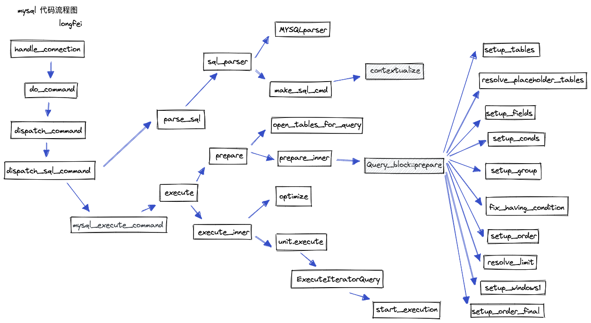
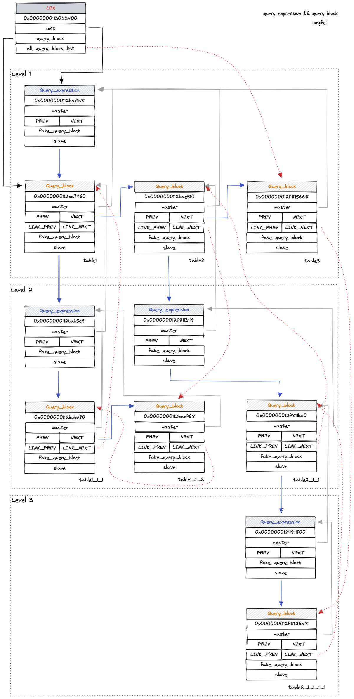
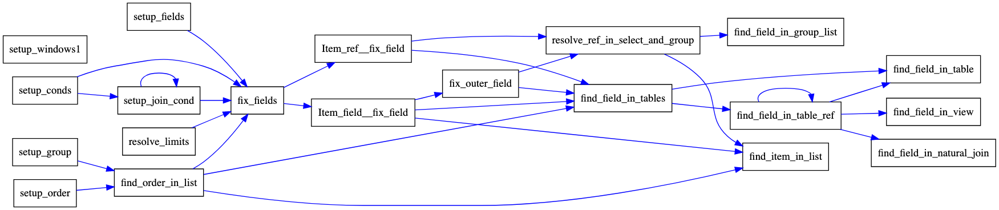
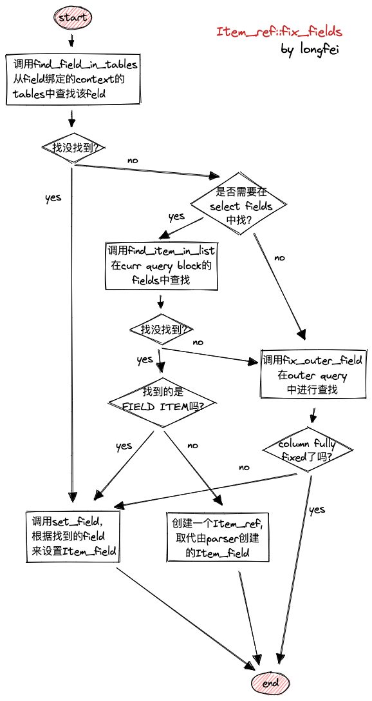
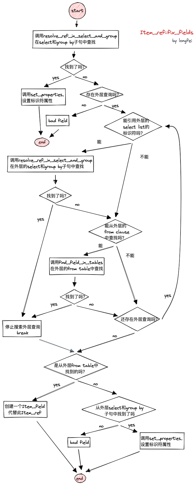
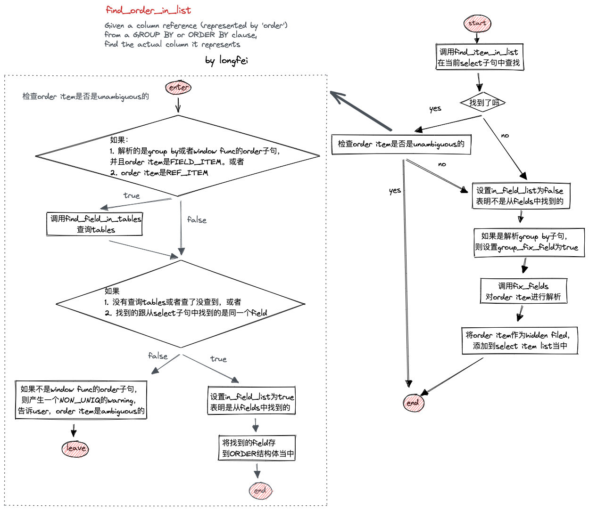

这算是我第一次细看 mysql 的源码，name resolution 这块陆陆续续看了有段时间了，也积累了一些材料，是时候总结一下了。虽说如此，mysql 的代码啃起来难度还是非常大的，不得不承认，有很多细节之处到现在自己还未能理解，也可能存在有一些地方自己以为自己理解了，所以，文章里面的错误还恳请批评指正。

## 序言

### 初识 mysql 源码

介绍一些基本术语，以便下文中更好的进行描述。

- THD

    thread/connection descriptor，一个客户端连接对应一个THD。

- LEX

    LEX的作用比较多，其一是作为查询处理模块的工作区，维护查询处理所需要的数据结构。

- Item

    Item 这个词在 mysql 的源码世界中指代的是表达式，囊括了常量、运算符、函数等等非常多的内容。

- Column Reference

    即列引用，在源码注释中常可以看到这个词，有时候会简写为 Column Ref，注意与下面的 Ref 区分。通常列引用可以理解为列名，即 sql 中出现的列名。在代码中对应的数据结构是 Item_field。

- Ref

    列引用的引用。在代码中对应的数据结构是 Item_ref。在 parser 阶段，mysql 判断 sql 中的符号是 Column Ref 还是 Ref 的逻辑如下所示：

    ```
    if ((pc->select->parsing_place != CTX_HAVING) || // 不在 having 子句中，或
        (pc->select->get_in_sum_expr() > 0)) { //  在聚合函数中
      *res = new (pc->mem_root) Item_field(POS(), NullS, NullS, ident.str);
    } else {
      *res = new (pc->mem_root) Item_ref(POS(), NullS, NullS, ident.str);
    }
    ```

    也就是说，Having 子句中不在聚合函数里的那些标识符，会被当作 Ref。在代码中对应的数据结构是 Item_ref。


### 查询解析

查询解析是指对用户输入的 sql 语句中的标识符作合法性检查的过程，如：

`select cos(a) a from t1 group by a having count(*)<1;`

当中的 group 子句就非常有意思：请问该 sql 最终按照什么进行分组？（最终按照表 t1 中的 a 列来分组而不是 `cos(a)`）查询解析是 sql 的地基，经过解析后的 sql 都拥有正确语义。

查询解析分为两个步骤，如下图阴影方框所示：第一是 contextualize，第二是 prepare。contextualize 完成一些名称解析的准备工作，主要是遍历 ast，建立和维护好名称解析的数据结构；prepare 阶段则是以建立好的 query block 为基础，调用解析函数，完成名称解析。这些内容将在下文中做详细的介绍。



下面列出的是部分查询解析相关的错误，通过这些错误，我们也能够从侧面了解名称解析所做的工作是什么。mysql 中的所有错误均可在 [Server Error Message Reference](https://dev.mysql.com/doc/mysql-errors/8.0/en/server-error-reference.html)页面查询到。

- ER_NO_SUCH_TABLE（1146），指定的表不存在。
- ER_BAD_DB_ERROR（1049），指定的库不存在。
- ER_NON_UNIQ_ERROR（1052），列是模糊的，指定列名的信息不足以推断出其属于哪张表。 错误中包含模糊列的位置信息。 在 mysql 源码中，位置信息保存在 `thd->where` 变量上，变量类型是 `const char *`。
- ER_BAD_FIELD_ERROR（1054），指定的列不存在
- ER_WRONG_FIELD_WITH_GROUP（1055），select 中出现了非聚合列。标准行为是：当有分组（group by）时，select列表中只能出现聚合函数和聚合列。在mysql中，这个行为受到[ONLY_FULL_GROUP_BY](https://dev.mysql.com/doc/refman/8.0/en/sql-mode.html#sqlmode_only_full_group_by)的影响。 mysql处理group by的文档：[MySQL Handling of GROUP BY](https://dev.mysql.com/doc/refman/8.0/en/group-by-handling.html)。
- ER_INVALID_GROUP_FUNC_USE（1111），错误的使用了聚合函数。
- ER_NONUNIQ_TABLE（1066），表名的alias不唯一。
- ER_DUP_FIELDNAME（1060），如：`select * from (select c1,c1,c2 from t) t1 where c2='2040-08-20';`
- …

## 语境化

语境化（**contextualize**）是指 mysql 在完成词法语法解析之后，对语法树进行遍历，建立并维护 mysql 数据结构的过程。接下来将描述：建立维护什么样的数据结构以及如何建立和维护这些结构体。

### 数据结构

- QueryExpression 和 QueryBlock

    mysql 通过 QueryExpression 和 QueryBlock 来组织整条 sql 的数据结构。通常一条 sql 由 select, union, subquery 等等组成。可以简单地将包含一个 select 子句的部分视为一个 query block。包含 union 的 sql 由多个 query block 组成，这些 query block 共同组成了 query expression，而包含 subquery 的 sql 则是由 query expression 将每层的 query block 串联起来形成层级结构。可以结合 mysql 源码中给出的一个 case 来帮助理解 query expression 和 query block 所组成的层级关系， 如下所示：

    ```sql
    select *
      from table1
      where table1.field IN (select * from table1_1_1 union
                             select * from table1_1_2)
      union
    select *
      from table2
      where table2.field=(select (select f1 from table2_1_1_1_1
                                    where table2_1_1_1_1.f2=table2_1_1.f3)
                            from table2_1_1
                            where table2_1_1.f1=table2.f2)
      union
    select * from table3;
    ```

    在 mysql 源码中使用 ascii 画出了该条 sql 的 query expression 结构图。我通过调试源码，画了一份更直观的图，如下所示：

    

    - 说明：
        - query expression 和 query block 都拥有 master 和 slave 域，分别指向对方
        - union 连接的多个 select 子句呈现兄弟关系，通过 query block 的 NEXT 指针串起来
        - 子查询会增加 query block 的嵌套深度
- TableList 和 SQLIList 双剑合璧

    TableList 是 from 子句中指定的表引用，其中保存重要的信息包括：库名，表名，别名等重要信息。每个 query block 中涉及到的表，都会以 TableList 的形式保存到链表上。SQLIList 是一个链表的辅助结构体，其包含一个指向下一个将要插入节点位置的二维指针，类型为 `TableList`， 通过 SQLIList 可以快速的在链表尾部进行插入操作。SQLIList 插入节点如下所示：

    1. 初始状态时 first 置空，next 指向 first
    2. 将 *next 指向要插入的元素（对于插入头一个元素，next指向first）
    3. next 指向要插入元素的 Next 指针
- Name_resolution_context

    Name resolution context 存储一些名称解析的必要信息，这些信息最终会传递给 Item，在 Item 进行 fix_fields 的时候派上用场。


### 主要代码流程

维护参与 sql 的表和 join 的数据结构的过程是在对 from 子句的语境化过程中完成的，代码主要位于 table reference 的 contextualize 函数中。

- table reference从形式上看，表名可能以以下形式展现出来：
    1. 表名，如 `from t1，from db.t1`。每张表还可以起一个别名，如 `from t1 as alias1`
    2. 表列表，如 `from t1, t2, t3`
    3. join，如 `from t1 join t2`, `from t1 left join t2 on t1.id=t2.id`
    4. 派生表，如 `from (select id from t1) as subselect`

    对于上述不同形式的table，mysql中分别有不同的数据结构与之对应：

    1. 表名对应 PT_table_factor_table_ident
    2. 表列表对应 PT_table_reference_list_parens
    3. join 对应 PT_joined_table
    4. 派生表对应 PT_derived_table
- 维护 table_list

    维护 table_list 的主要函数是 `add_table_to_list`，无论哪种形式的 table reference，最终都会调用到该函数，并在 SQLIList 的帮助下，将 table reference 对应的 TableList 插入到链表中。除了将 TableList 串起来之外，add_table_to_list 还会做一些其他工作：

    - 处理别名derived table必须指定别名，否则抛错 ER_DERIVED_MUST_HAVE_ALIAS；如果没有指定别名，会使用表名（不包含db限定部分）作为别名
    - 添加db限定如果用户对表名指定了db限定，那么使用该db限定；否则，使用当前数据库作为该表的db限定。要特别注意的是，derived table的db限定不为空（nullptr），而是空字符串（""）。
    - 检查名称的唯一性遍历所有的表，对比别名是否一样，以及db是否一样。举例：
        - `select * from t1 join t1;`
        - `select * from t1 join (select 1) as t1;`

        第一条 sql 不合法，而第二条 sql 是合法的。

- 维护 join_list

    join_list 是一个由 TableList 组成的 deque。维护 join_list 由两个函数完成：`add_joined_table` 和 `nest_last_join`。add_joined_table 将 table 放到 join_list 中。contextualize过程中，每往 table_list 中插入一个元素，就会往 join_list 中放入一个元素。nest_last_join 从 join_list的 头部取 n个 table 组成一个特殊的 TABLE_LIST，名为"nest_last_join"，并将 "nest_last_join" 放回 join_list 的头部。


LEX中有一个 Name_resolution_context 类型的栈，名为 context_stack，用于维护子句中表达式的名称解析的上下文。比如：JOIN ... ON (some_condition) 的 some_condition 中的表达式，其名称解析的context 只能是参与 join 的两张表；子查询中的表达式的名称解析的 context 只能是当前子查询以及外层查询。当有 clause 需要 local context 时，mysql 会新建一个 context 并将其置入 context_stack 的栈顶，所有新建的表达式都会存储 context_stack 的栈顶 context，作为自己的名称解析的 context，当该 clause 处理完毕，从 context_stack 中弹出新建的 context。

如下场景中会 push 一个新的 context 到栈中：

- 新建一个 query block 的时候。而我们已经知道，在处理union、subquery的时候会分别新建一个query block
- 解析 join 的 on 条件的时候
- 处理 derived table 的时候
- 处理 CTE 的时候
- 处理那些单独的 order by 和 limit 的时候

mysql parser 在新生成 Item_ident 的时候，会取栈顶的 context 赋值给 Item_ident。

## Prepare

mysql 实现了数十个函数，用以做名称解析。这些函数的调用关系如下所示：



注：时至制作上图时，我对 setup_window1，也就是窗口函数的名称解析部分的代码仍未研究，故上图中的 setup_window1 是孤立的。

我们接下来将分析其中主要的几个函数的实现过程，其他还有一些解析函数，受限于篇幅，均为展开详细介绍，读者可以在上图的帮助下厘清各个函数的功能作用。

### fix_fields

fix_fields 是 mysql 名称解析过程中最重要的接口之一，主要用来对表达式进行名称解析。在 mysql 中，每个 Item 都需要实现 fix_fields，其中最重要的两个便是 Item_field 和 Item_ref，分别用来解析 Column Reference 和 Ref。

- Item_field

    对于 Item_field 来说，总是先在其 context 的 TableList 链表上进行查找，可以简单的理解为从 from 子句中进行查找。找不到的情况下，则去外层 query block 中进行查找。对于某些子句中的 Item_field 来说，在查外层 query block 之前，还可以去 select 子句中的 fields 中上进行查找。代码流程如下图所示：




- Item_ref

    对于 Item_ref 来首，会先从 select 和 group by 子句中查找。没找到的情况下，会迭代到外层 query block 中进行查找。代码流程如下图所示：

    

    ### find_order_in_list

    在 mysql 中，order by 子句和 group by 子句的条目共用同一个结构体 ORDER，所以它们的名称解析最终都是调用 find_order_in_list 来完成的。find_order_in_list 先在当前的 select 子句中进行查找，在没找到的情况下才会对 order by 或者 group by 的表达式进行 fix_fields。而找到的情况下，对于group by 子句还会有额外的检查 「order item 是否是模糊的」的过程。

    具体代码流程如下所示：

    

    ## 结语

    本文将我这些日子看 mysql 的材料作了归纳总结，一方面是为了以后遗忘时各方便的捡起来，另外一方面，也希望帮助到对 mysql 这方面感兴趣的人。

    受限于作者的水平，本文中难免有遗漏和错误（P.S.或者根本理解就不对，我甚至怀疑将来的某一天我回头看这篇文章的时候会不会觉得狗屁不通），敬请谅解。