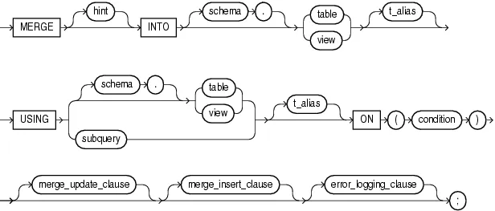
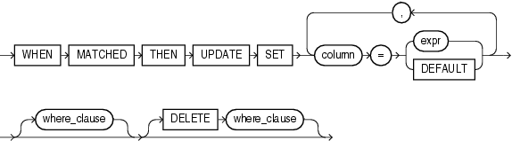
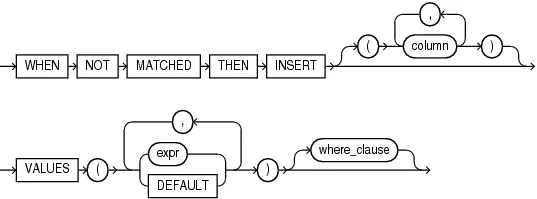
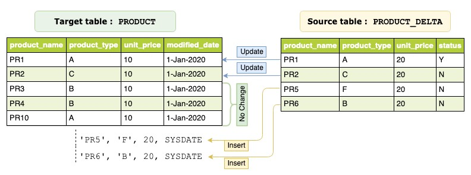

a.k.a. Upsert， SQL:2003 标准引入，能够在一条 sql 语句中，根据不同的条件，分别执行 update、delete 和 insert，非常强大好用。

有许多数据库都实现了 merge 的功能，包括 PostgreSQL， DB2 等，也有一些数据库实现了类似的功能，如 MySQL 的 `insert .. on duplicate key`， `replace` 等。

本文主要研究 Oracle 12 中 merge 的实现，并给出在 KunDB 中实现 merge 的一些想法。

## Introduction

### merge 语法

merge into 主要分为三个主要分支：主分主，update 分支和 insert 分支：

- 主分支：通过 into 子句指定了 merge 的 **TARGET**，即 merge 操作的目标表，无论后续执行 update 还是 insert，抑或是 delete，都是在 target 上执行的；通过 using 子句指定了 merge 的 **SOURCE**，即 merge 操作的源，源指定了数据的来源，可以是表，视图或者子查询。merge 可以使用 source 返回的数据来更新或者将其插入到 target 中；on 子句指定了匹配条件，后续执行的具体操作由 on 子句指明，如果 on 中表达式返回 true，即匹配，则执行 update 分支，如果返回 false 或者 null，则不匹配，执行 insert 分支。



- update 分支：当 on 子句中指定的条件返回 true 时，会执行 update 分支，会根据 set 子句指定的表达式对 target 表进行更新，也可以指定 where 子句，这样只会对 target 中满足 where 条件的行进行更新。

    不能 update 在 on 条件中出现的列。

    在 update 分支中可以指定 delete 操作：

    - delete 不会删除 insert 插入的数据

        > The only rows affected by this clause are those rows in the destination table that are updated by the merge operation.
        >
    - delete 的 where 条件是根据 update 之后的数据进行评估的

        > The `DELETE` `WHERE` condition evaluates the updated value, not the original value that was evaluated by the `UPDATE` `SET` ... `WHERE` condition.
        >
    - 源表中没有被 join 选取的行，即使满足 delete 条件，也不会被删除

        > If a row of the destination table meets the `DELETE` condition but is not included in the join defined by the `ON` clause, then it is not deleted.
        >



- insert 分支：当 on 子句返回 false 时，执行 insert 分支。如果 on 子句的条件是 **constant filter predicate**，如 `ON` (`0=1`)，Oracle 会将 merge 转为 insert，避免 join。同样，insert 也可以指定 where 子句，当满足条件时才会插入。
    - insert 可能会导致主键冲突

        ```sql
        -- t1: (1,2)，t2: (1,3) && t1.a is primary key
        merge into t1 using t2 on (t1.b = t2.b)
        when not matched then insert values(t2.a, t2.b);
        ```

    - merge 的 delete 和 update 对 insert 可见

        ```sql
        -- t1: (1,2)， t2: (1,3),(2,2) && t1.a is primary key
        merge into t1 using t2 on (t1.b = t2.b)
        when matched then update set a = t2.a [delete where a = 2]
        when not matched then insert values(t2.a, t2.b);
        ```




其他需要注意的地方：

- merge是一个确定性的陈述，无法在同一 merge 语句中多次更新目标表的同一行

    需要 Single Join，或者 merge 算子进行 runtime 检测


### merge 执行

```sql
MERGE INTO PRODUCT prd
USING PRODUCT_DELTA src
ON (prd.product_name = src.product_name
    AND prd.product_type = src.product_type
   )

WHEN MATCHED THEN
     UPDATE SET
         prd.unit_price = src.unit_price,
         modified_date  = SYSDATE

WHEN NOT MATCHED THEN
     INSERT(product_name, product_type, unit_price, modified_date)
     VALUES(src.product_name, src.product_type, src.unit_price, SYSDATE);
```


merge 首先会 perform 一个 left join，即 source RIGHT OUTER JOIN target ON match_condtion，并以 left join 的数据为输入，进入 merge 的处理流程。

朴素算法：

```go
for each row in INPUT
  a <- matched(row) // 对于输入的每一行，判断是否匹配
	if a is true // 匹配上了，走 update 分支
		b <- calc_where(update_where, row) // 判断 update 的 where 条件是否为真
    if b is true // 满足 update 的条件
      new_row <- calc_update(row) // 根据 set 子句，计算出 new_row
			c <- calc_where(delete_where, new_row) // 用更新后的数据计算 delete 的 where 条件是否为真
      if c is true // 满足 delete 的条件
				delete_target(row) // 从 target 中删除该行
      else // 不满足 delete 的条件
				update_target(row, new_row) // 更新 target
      endif
    endif
	else // 没有匹配上，走 insert 分支
		d <- calc_where(insert_where, row) // 判断 insert 的 where 条件是否为真
    if d is true
	    insert_target(row) // 将 source 的数据插入到 target 中
  endif
endfor
```

## REF

- [Merge (SQL)](https://en.wikipedia.org/wiki/Merge_(SQL))
- [SQL Language Reference](https://docs.oracle.com/en/database/oracle/oracle-database/12.2/sqlrf/MERGE.html)
- [OceanBase 的 MERGE INTO 并行实现要点_maray的博客-CSDN博客](https://blog.csdn.net/maray/article/details/131181227)
- [Best practices for migrating Oracle database MERGE statements to Amazon Aurora PostgreSQL and Amazon RDS PostgreSQL | Amazon Web Services](https://aws.amazon.com/cn/blogs/database/best-practices-for-migrating-oracle-database-merge-statements-to-amazon-aurora-postgresql-and-amazon-rds-postgresql/)