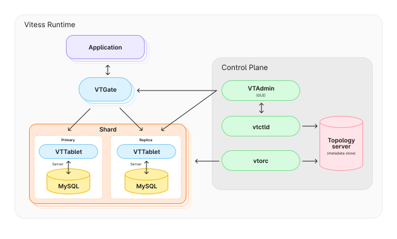
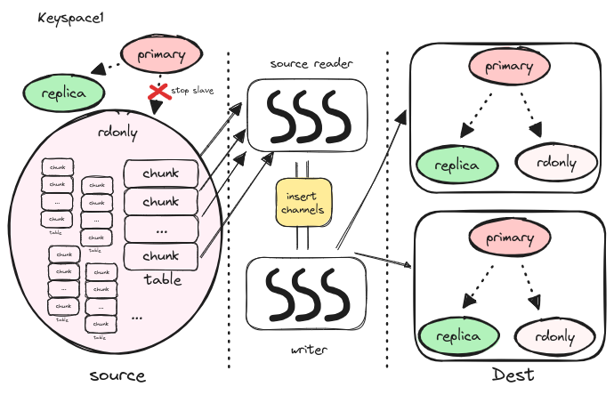
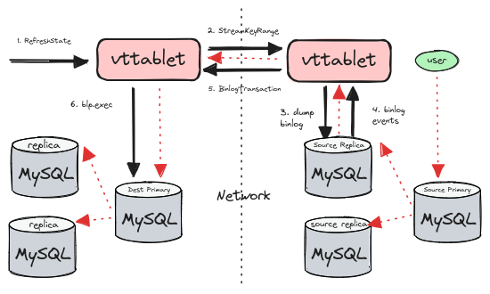
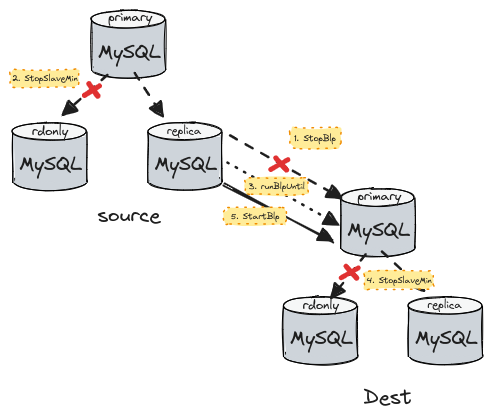

## 背景

[Vitess](https://github.com/vitessio/vitess) 是基于 mysql 的中间件，管理大规模 mysql 集群。
因为工作的原因，在多年以前，研究过它的水平扩缩容方案。去年组里重构了这块，我便又将当时看得内容回顾了一遍，在此简单的记录一下。

本文对应的代码版本：[点我看上古版本](https://github.com/vitessio/vitess/tree/24c74fcf2cdbca18327a41122fec36fa2ce68fac)


### Vitess 架构简述

vitess 架构不是本文的重点，但为了行文的完整性，本节向读者简单介绍一下 vitess 的架构以及一些关键的概念。

此处借用 [vitess.io](https://vitess.io) 上的架构图：



- vtgate：gate 是 vitess 对外提供服务的接口，支持 grpc 协议和 mysql 协议，用户可以像使用
mysql 一样，使用 mysql 客户端连上 gate，执行 sql

- vttablet：vttablet 与 mysql 实例是一对一的关系，通常部署在同一个节点，vttablet 和 mysql
通过 socket 进行通信

- topo server：元数据集群，通常是 zk 或 etcd 保存整个 vitess 集群的元数据信息

- vtctld: 集群运维接口，对外提供很多有用的命令。用户可以通过 vtctlclient 来完成对集群的管理
和维护

- shard：一个 mysql 复制组，包含一主多备。每个 shard 存储一部分数据，shard 内部所有 mysql 的主备通过 binlog 同步数据，数据最终一致。
shard 是一个逻辑概念，每个 shard 中有若干个 vttablet。

- shard naming: vitess 的 shard 名字代表着 shard 中所包含的数据的范围。
    - vitess 将所有的数据映射到正整数空间，即使用 0 - 正无穷 表达完整的数据范围。
    每个 shard 的名字都是一个左闭右开的范围，如 `40-80`，表示 [40, 80) 范围的数据都保存在我这个 shard 上
    - 起点是 0 或终点是正无穷可以省略，如 `-80` 表示 [0, 80)，`80-` 表示 [80, 正无穷），`-` 表示所有的数据
    - 数字采用 16 进制，左对齐，右补零的。`-80` 表示正整数域的前半部分，`-80`， `00-80`，`0000-8000` 表示相同的范围；
    `ffff` 不属于 `80-ff`

- shard key: 分片键

- keyspace：可以认为是 vitess 的逻辑数据库。一个 keyspace 可以包含若干 shard，数据 hash
分布在所有的 shard 上

## 步骤

### 准备

vitess 的水平扩容需要准备新的节点，并在新的节点上启动新的 shards，新 shards 和老 shards
属于同一个 keyspace，新启动的 shards 处于未服务的状态。老的 shards 代表的是整个 keyspace，
新的 shards 也代表了整个 keyspace，扩容就是将数据从老的 shards（source），迁移
到新的 shards（dest）上，并将服务也迁移过来的过程。

这种方案需要新旧集群共存，并在扩容完成后停止旧集群，将服务转移到新集群，特别适合在云上部署时使用。

假设我们已经存在一个单节点的 vitess 集群，其仅包含一个 shard0，现准备扩容到双节点，
那么我们就需要额外部署一个包含两个 shard 的同名 keyspace。

vitess 需要手动指定每一张表的 shard key，一扩二的之前需要通过 `ApplyVSchema` 命令为 source
集群中的每一张表指定 shard key。


### CopySchemaShard

目的集群是全新的，没有任何数据，扩容的第一步，从源 keyspace 的主上拷贝元数据到目的 keyspace 的主上，
然后在通过复制协议传播到目的集群的其他副本上。

原理：通过在 source shard 上执行一系列 sql，获取元数据，并在 dest shard 上进行回放。

1. 查询 information_schema.tables 查询库中所有的表
2. 执行 `show create table` 拿到建表语句
4. 将建表的 sql 发给目的执行

拷贝完成后会进行简单校验，检查源和目的的表数量和名称确实是一致的。这一步主要是防止：万一目的上 database
已存在，但是 database option 不一样的场景，比如：默认两个库字符集不同，这种情况下目的 mysql 就会跳过建表语句。

### LegacySplitClone

接下来，开始拷贝数据。

拷贝数据这步是离线处理的，不会影响线上业务，原理就是选择 source shard 中的一个 rdonly 副本，
停掉它的流水，然后将数据拷贝到新的集群上，source shard 中的 primary、replica 以及其他 rdonly 都不会受影响。

#### 全量同步

下图所示展示的是一扩二的全量同步的过程：



1. 对于每个 source shard：
    - 随机找到其一个 healthy rdonly 副本，使用 `stop slave` 停其流水
2. 对于每个 dest shard：
    - 找到其主，也就是 primary 节点
3. 对于每个 dest primary：
    - 为其绑定一个 insertChannel，并启动若干个 writer
    - 这些 writer 从 insertChannel 上读取 sql，发送给目的主执行
    - 这些 sql 便是一条条的插入语句，将数据插入到 destination 当中
    - 如果目的主跪了，writer 会定期重试，直到有一个新主诞生，或者超时
4. 对于每个 rdonly 节点：
    - 我们都会依次处理每一张表，将表的数据转换为 insert 语句，发送到 insertChannel 上
5. 对于每张表：
    - 首先会调用 `generateChunks` 将其切分成一个个的 chunk，切分方法也比较简单，前提条件是该表有整型类型的主键
    - 使用 `select min(pk), max(pk) from t` 确定数据范围，然后在按照 source reader 的个数和 chunk 最小行数的要求构造出来若干个 chunk
    - 如果不满足条件，那么就会将整张表作为一个完整 chunk
6. 对于每个 chunk：
    - 启动一个 go 协程，读取其数据，拼出 insert
    - 每个 go 协程便可看作一个 source reader
    - 使用信号量控制 source reader 的数目
7. 对于每个 source reader：
    - 其负责处理某张表的某个 chunk
    - 根据 chunk 的范围拼出 sql：`select * from t where pk >= x and pk < y order by pk`
    - 然后使用 gRPC 流式接口从源 rdonly 上不断将该 chunk 的数据读取回来
    - 每次读回来一批，称为一个 pack，每读取一个 pack，packCount 自增 1
    - 对于读回来的数据，按照 shard key 进行 split，归属于同一个 dest shard 的分为一类
    - 当读取了 destination_pack_count 个 pack 后，将每一类数据拼成一条 insert 语句
    - 将 insert 语句发往 dest shard 绑定的 insertChannel 上

上面所描述的数据拷贝便是全量数据迁移的过程。

在全量同步完成以后，我们会在目的 shard 中创建一张 `_vt`.`blp_checkpoint`：

```sql
CREATE TABLE IF NOT EXISTS _vt.blp_checkpoint (
  source_shard_uid INT(10) UNSIGNED NOT NULL,
  pos VARBINARY(64000) DEFAULT NULL,
  max_tps BIGINT(20) NOT NULL,
  max_replication_lag BIGINT(20) NOT NULL,
  time_updated BIGINT(20) UNSIGNED NOT NULL,
  transaction_timestamp BIGINT(20) UNSIGNED NOT NULL,
  flags VARBINARY(250) DEFAULT NULL,
  PRIMARY KEY (source_shard_uid)
) ENGINE=InnoDB;
```

然后使用 `show slave status` 查询 source rdonly 的 `Executed_Gtid_Set`，`Seconds_Behind_Master` 等
流水信息，并将这些信息记录在 `blp_checkpoint` 表中。换句话说，blp checkpoint 此时记录就是全量同步的起始点。

注意：
1. 这里是在目的 mysql 上记录了源 mysql 的流水位置，跨 mysql 复制组了
2. pos 指的是 gtid

除此之外，我们还会在 topo server 上记录下来 dest shard 的每个 source shard 的信息，
这些信息保存在 dest shard 的 ShardInfo 中。

除了全量迁移，LegacySplitClone 还会在最后开启增量同步：
强制所有 dest tablet 读取 topo server 刷新状态，
dest master 会在刷新状态的最后开启 `filtered replication`，
也就是增量同步。

#### 增量同步

刚提到，全量同步的最后，会强制所有的目的 tablet 进行 RefreshState。refresh state 过程中会做很多与
状态管理相关的工作，每次 tablet 的状态发生改变时，都需要触发到 refresh state 进行状态的管理。
但其中与 resharding 相关的是，在 refresh state 的最后，dest primary 会建立与每个 source shard 之间的流水同步。

source 和 dest shard 代表两个不同的 mysql 复制组，
它们之间的流水同步是通过 tablet 的 UpdateStream 和 BinlogPlayer 完成的。
通俗地说，vitess 在 tablet 上实现了 binlog 复制协议，tablet 之间可以同步流水。
tablet 之间的流水同步也被称作 filtered replication。

下图展示的是增量同步的步骤：



1. dest primary 接收到 RefreshState 后，启动 binlog player
2. binlog player 从 `blp_checkpoint` 中读取 start pos
2. binlog player 调用 StreamKeyRange 与 source replica 之间建立 grpc 连接，并将 pos 发给 source replica
3. source replica 接收到了 StreamKeyRange 请求之后会新建一个 streamer（bls），然后发送 dump binlog 给 mysql
4. mysql 接收到 COM_BINLOG_DUMP_GTID 后，从指定 pos 处开始 dump binlog，并将 binlog event 返回给 tablet
5. source replica 接收到 binlog event，封装成 BinlogTransaction，通过 rpc 流返回给 dest primary
6. dest primary 处理 BinlogTransaction，读取新的 pos，更新 `blp_checkpoint`, 然后执行 blp.exec 回放事务

图中红色线条代表了数据的流向：用户在 source primary 上执行的 sql，通过 binlog 复制给
source replica，再经过 tablet，grpc stream 流向 dest primary，再通过 binlog 复制
到 dest 集群。

### SplitDiff

SplitDiff 是对 source 和 dest 的数据进行 diff 操作，以确保两个集群的数据是一致的。

vitess 的做法是从 source 和 dest 各选出一个 rdonly 角色，将它们的流水停在同一个 binlog position（synchronizeReplication），
然后从两个 rdonly 角色上按主键排序读取数据，再逐行比较（diff）。

diff 的流程比较简单，我们重点回顾一下 vitess 是如何让两个 rdonly 停在同一个 position 的。

synchronizeReplication 的步骤如下图所示：



1. 调用 `StopBlp` 停止 dest primary 上的 binlog player

    也就是断开 dest primary 和 source 集群之间的 filtered replication，
    StopBlp 会返回 dest primary 上 `blp_checkpoint` 表中记录的 pos

    注意：这个 pos 其实是 source mysql 复制组中的 binlog gtid

2. 调用 `StopSlaveMinimum` 停掉 source rdonly 和 source primary 之间的流水

    StopSlaveMinimum 接收上一步传入的 pos 作为参数，依次：
    - 调用 `WaitMasterPos`，执行 `SELECT WAIT_UNTIL_SQL_THREAD_AFTER_GTIDS` 等待当前 mysql 节点追上给定 pos
    - 调用 `StopSlave`，执行 `STOP SLAVE` 停掉 source rdonly
    - 调用 `MasterPosition`，执行 `SELECT @@GLOBAL.gtid_executed` 查询当前 mysql 节点的 gtid 并返回

    如此一来，source rdonly 的流水就停在了 dest primary 已回放的点。

3. 调用 `runBlpUntil` 让 dest primary 追上 source rdonly 的 binlog

    binlog player 能够接收两个参数，一个是 start pos，这是发送 COM_BINLOG_DUMP_GTID 给
    mysql 时传递的参数，告诉 mysql 从什么位置开始 dump binlog；另外一个是 stop pos，如果
     stop pos 为空，binlog player 就会一直追流水，如果不为空，binlog player 在回放完一个
    事务的时候会判断是否追上了 stop pos，追上了之后就会停止。

    runBlpUntil 将第二步中返回的 pos 作为 stop pos 启动 dest primary 的 binlog player。

    如此一来，dest primary 回放的 binlog 就一定超过了 rdonly 停掉时间点。

4. 调用 `StopSlaveMinimum` 停掉 dest rdonly 和 dest master 之间的流水

    经过第四步，dest rdonly 的回放的 binlog 的位置与 source rdonly 的 binlog 位置相同。
    通俗地说，也就是 dest rdonly 和 source rdonly 停在了同一个 binlog pos。

5. 调用 `StartBlp` 重启 dest primary 和 source 之间的 filtered replication

    重启 dest primary 的 binlog player，再我们比较数据的时候，dest 和 source 之间的增量
    数据仍在同步。

经过这 5 个步骤，可以得到两个停掉流水的 rdonly 节点，这两个 rdonly 节点分别属于 source 和
dest 集群，并且停在了同一 binlog position，因此它们的数据应当是一致的。接下来我们就会对比这两个
rdonly 之间的数据，来验证全量同步和增量同步的准确性。

完成数据的校验工作后，我们需要执行 `START SLAVE` 将两个 rdonly 放回的各自的复制组中去。

### MigrateServedTypes

虽然完成了数据的全量和增量同步，但是整个 vitess 现在仍然是老的 shard 在对外提供服务。
因此，我们需要将服务迁移到新集群上，换句话说就是新集群接替旧集群对外提供服务。
迁移工作是分角色进行的，首先迁移的是 rdonly 和 replica 角色，最后迁移 primary 角色。

在迁移 primary 角色的时候，首先会让旧集群的 primary shard 停止接收更新，然后调用 `waitForFilteredReplication`
 等待新集群的 primary 追上旧集群的流水，然后对外提供服务。

当 primary 节点完成服务迁移，filtered replication 也会停止，代码中只需要将 source shards 置为空即可：

```go
// for master migration, also disable filtered
// replication
if servedType == topodatapb.TabletType_MASTER {
    si.SourceShards = nil
}
```

### CleanUp

完成扩缩容后，source 集群不再提供服务，可以被安全的移除。
topo server 保存的关于 source tablet 的信息也需要清除。
