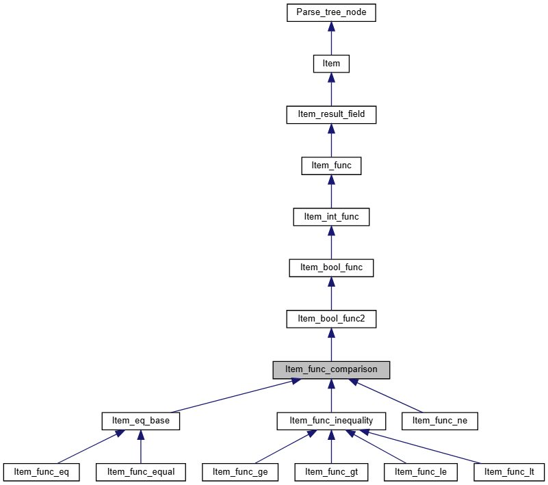
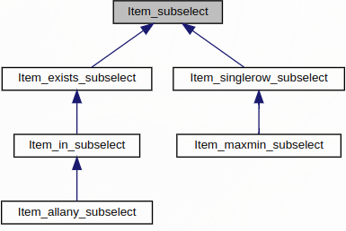

## MySQL 文档

[Row subquery](https://dev.mysql.com/doc/refman/8.0/en/row-subqueries.html) 是 subquery 的变种，返回一行数据，区别与 scalar subquery，row subquery 可以返回多列。MySQL 里面 row subquery 是指 single row subquery。

与scalar subquery类似，row subquery 可以返回空集或者一行数据，当返回多行时则会报错。

row subquery 支持 如下运算符：

```sql
=  >  <  >=  <=  <>  !=  <=>

(a, b) > (x, y) 等价 (a > x) OR ((a = x) AND (b > y))
(a, b) >= (x, y) 等价 (a > x) OR ((a = x) AND (b >= y))
(a, b) < (x, y) 等价 (a < x) OR ((a = x) AND (b < y))
(a, b) <= (x, y) 等价 (a < x) OR ((a = x) AND (b <= y))
(a, b) <> (x, y) 等价 (a <> x) OR (b <> y)
(a, b) <=> (x, y) 等价 (a <=> x) AND (b <=> y)
(a, b) = (x, y) 等价 (a = x) AND (b = y)
```

仅在用于比较与 row construct比较的时候才可以使用返回多列的子查询。

> You may use a subquery that returns multiple columns, if the purpose is row comparison.
>

row subquery 仅支持多余一列的子查询，以下查询返回语法错误：

```sql
SELECT * FROM t1 WHERE ROW(1) = (SELECT column1 FROM t2)
```

MySQL 建议不要混用 row constructor 和 AND/OR 表达式：

> Thus, for better results, avoid mixing row constructors with AND/OR expressions. Use one or the other.
>
>
> https://dev.mysql.com/doc/refman/8.0/en/row-constructor-optimization.html
>

Multi-Row Subquery

in 子查询也可以用于 row constructor 比较，但是 MySQL 里面好像没有指明其属于 row subquery，有些其他的数据库将其称为 multiple row subquery。

## 源码

20年前 MySQL 的提交：

- https://github.com/mysql/mysql-server/commit/7a9f47759ed74bb05bf95769db21cc375798b199

- https://github.com/mysql/mysql-server/commit/4cfb6d97b54a12ea4e5d9e2eb0b671e602ee99f2

以如下 Q1 为例：

```sql
select * from t1 where (c2, c3) = (select c2, c3 from t2 limit 1);
```

对于 Q1，where 条件匹配如下语法：

```cpp
| bool_pri comp_op predicate
          {
            $$= NEW_PTN PTI_comp_op(@$, $1, $2, $3);
          }
```

也就是说， MySQL 会生成一个 PTI_comp_op 结构体来描述 Q1 中的 row subquery。

在 **contextualize 阶段**，代码会走到 PTI_comp_op::do_itemize 函数中，从而将语法节点 PTI 转换为 Item，即 MySQL 中的表达式，转换逻辑如下：

```cpp
bool PTI_comp_op::do_itemize(Parse_context *pc, Item **res) {
  super::do_itemize(pc, res) || left->itemize(pc, &left) ||
      right->itemize(pc, &right)
  *res = (*boolfunc2creator)(false)->create(left, right);
}
```

comp_op 是一个二元 operator，所以先递归的对 left 和 right 两个参数进行 itemize，接着调用 create 函数生成相应的 Item。不同的 comp_op 对应不同的 boolfunc2creator，如 ‘=’ 对应 comp_eq_creator，最终会调用 Linear_comp_creator::create，生成 Item_func_eq，其代表的就是等值比较表达式， Item_func_eq 继承 Item_bool_func2，而后者又继承 Item_func， Item_func_eq 继承关系如下图所示（Item 是 MySQL 里面所有表达式的基类）：



[Item_func_comparison 继承关系](https://dev.mysql.com/doc/dev/mysql-server/latest/classItem__func__comparison__inherit__graph_org.svg)

这儿额外提一句， Linear_comp_creator::create 会在 comparison 两边都是 row constructor 时会将 row 表达式展开成 and 或者 or 表达式：

```sql
ROW(a, b) op ROW(x, y) => a op x P b op y.
ROW(a, ROW(b, c) op ROW(x, ROW(y, z))) => a op x P b op y P c op z.

P is either AND or OR
op is =, <> and <=>
```

comparison expression 需要两个参数 arg0 和 arg1，这两个参数保存在 Item_func 中，同时需要一个比较函数 `cmp`，cmp 保存在 Item_bool_func2 中， cmp 是一个 `Arg_comparator` 实例。

Arg_comparator 是一个辅助类，其定义了两个参数进行比较的一系列不同的 compare 函数：compare_string，compare_decimal，compare_datetime，compare_int_signed 等。在 **prepare 阶段**，调用 set_cmp_func，根据 arg0，arg1 以及期望的 result type 来确定使用哪个具体的 compare 函数。对于 Q1，其 set_cmp_func 的调用栈如下：

```cpp
// prepare 阶段
Query_block::setup_conds // 处理 where 或者 having 条件
  Item_func::fix_fields
    Item_bool_func2::resolve_type
      Item_bool_func2::set_cmp_func // 将 Arg_comparator 的 owner 设置为 bool_func2
        Arg_comparator::set_cmp_func
```

set_cmp_func 根据两个参数便能推导出该使用哪个 compare 函数。首先需要说明，在 MySQL 中每个表达式都有 data_type 和 result type，在 Item 中定义了获取 data type 和 result type 的接口，如下：

```cpp
class Item {
  inline enum_field_types data_type() const {
    return static_cast<enum_field_types>(m_data_type);
  }
  virtual Item_result result_type() const { return REAL_RESULT; }
}
```

其中， result_type 是个虚函数，每个子类都可以 override，返回自己的 result type；而 data_type 返回成员变量 m_data_type， 该成员变量通过 resolve_type 函数可以推导出来。

result type 包含：string， real， int， row， decimal，调用 type_to_result 可以将 data type 转换为 result type。

set_cmp_func 首先会根据左右参数的 result type 推导出期望的 result type，推导规则对应 `item_cmp_type` 函数，具体如下：

1. 如果两个参数的 result type 相同，则结果类型也为该类型
2. 两个参数中任意一个 result type 是 row，则结果为 row
3. 两个参数的 result type 都是 int 或者 decimal，则结果为 decimal
4. 上述分支都不满足，结果为 real 类型

然后在根据左右参数以及推导出的 result type 来评估选择哪一个 compare 函数：

1. 当 result type 不为 row 类型时，且至少一个参数 data type 是 json， result type 是 string 时，使用 `compare_json`
2. 两个参数能否当作 dates 进行比较（can_compare_as_dates 函数）？如果可以，使用 `compare_datetime`
3. 如果 result type 是 string 或者 real，且两个参数都是 time 类型，也可以使用 `compare_datetime`
4. 如果有一个参数是year类型，另一个参数是year，date，datetime等类型 （try_year_cmp_func 函数），也可以使用 `compare_datetime`
5. 根据 result type 选择对应的 compare 函数，然后在进行一下微调

当 result type 是 row 时，set_cmp_func 还会判断 comparison 左右两边的 Field 数目是否相等，并且对于每一列都会递归的调用 set_cmp_func 确定每个 Field 之间的比较函数。

对于 row subquery 而言，左侧对应的是 `Item_row`， 右侧子查询对应的类是 `Item_singlerow_subselect` 。Item_singlerow_subselect 由 PTI_singlerow_subselect 转换而来，其继承图如下所示：



[Item_subselect 继承关系](https://dev.mysql.com/doc/dev/mysql-server/latest/classItem__subselect.html)

Item_singlerow_subselect 可以是 scalar subquery，也可以是 row subquery，在 fix_fields 的时候，通过调用 Item_singlerow_subselect::create_row，将子查询的 select fields 保存在 `m_row` 成员变量中。

**执行阶段，**在 FilterIterator::Read() 函数中会调用 `m_condition->val_int()` 对 where 表达式进行评估，然后就会调用到 `Item_func_eq::val_int()` ，紧接着 `cmp.compare()` 。cmp 在 set_cmp_func 时已经生成好了，对于我们的例子，实际上调用的是 compare_row 函数，

compare_* 系列函数返回 0 表示左右参数相等，1 表示左边大，-1 表示左边小。

compare_row 的核心逻辑即依次比较每个 field，如果某个 field 不为 0，则后面的无须再比。

**Null 值处理**

首先介绍几个与 null 值处理相关的变量：

- Item 的 m_nullable， null_value

    m_nullable 表示一个表达式的结果是否有可能是 NULL，这个参数是在编译时期设置的，所以表示的是一种可能性，在 optimize 阶段也会进行调整；而 null_value 则表示的是该表达式的结果是否为 NULL。

- Item_bool_func2 的 abort_on_null

    abort_on_null 告诉 compare 函数，在遇到 null 值是否需要终止比较，通常意味着无须区分 null 和 false 的场景。

    其他的 bool_func 中也有名称相同的变量，如 Item_cond_and。对于 a and b and c and …，如果 b 的结果为 null，且这个表达式位于 where 条件中，此时 abort_on_null 为 true，那么 Item_cond_and::val_int 会直接返回 false。

- Arg_comparator 的 set_null

    set_null 表示在比较过程中如果遇到 null，需要记录到 owner 当中， owner 简单的认为是 compare 两个参数的 parent，也是一个 Item 类型。所谓的记录到 owner 当中，其实就是将 owner 的 null_value 设置为 true。


compare_row 时，当 owner 的 null_value 为 true 时，≠ 会忽略并继续往下比，而 <, <=, > 以及 ≥ 会直接返回 -1，而其他的 op 则取决于 abort_on_null 变量。

之所以 ne 需要继续往下比，是因为如果后面的 field 有不相等的，那么 ne 的结果是 true；如果后面的 field 全都相等，则 ne 的结果应当是 null，如下所示：

```sql
select (1,3) <> (null,4); ==> true
select (1,3) <> (null,3); ==> null
```

REF，https://bugs.mysql.com/bug.php?id=27704

**apply_is_true**

设置 abort_on_null 属性，相当于在原表达式 `e` 的基础上构造 `e is true`，对于 is true 表达式而言，false 和 null 是一致的。

- 对 if 表达式的 arg0 调用 apply_is_true

    > [`IF(***expr1***,***expr2***,***expr3***)](https://dev.mysql.com/doc/refman/8.0/en/flow-control-functions.html#function_if)`
    If **`*expr1*`** is `TRUE` (**`*expr1*** <> 0` and **`*expr1*** IS NOT NULL`), [`IF()`](https://dev.mysql.com/doc/refman/8.0/en/flow-control-functions.html#function_if) returns **`*expr2*`**. Otherwise, it returns **`*expr3*`**.
    >

    因此对于函数 if 来说，第一个参数为 null 和 false 是一致的。在 `Item_func_if::fix_fields` 时调用。

- 对于 having 和 where 子句中的表达式调用 apply_is_true

    where 和 having 条件中的表达式不区分 false 和 null。在 `PTI_context::do_itemize` 中会调用 apply_is_true。

- join 的 on 条件中

    `add_join_on` 中会对 join condition apply_is_true

- 其余在 mysql 优化阶段，仍需要维护好表达式的 abort_on_null 等属性